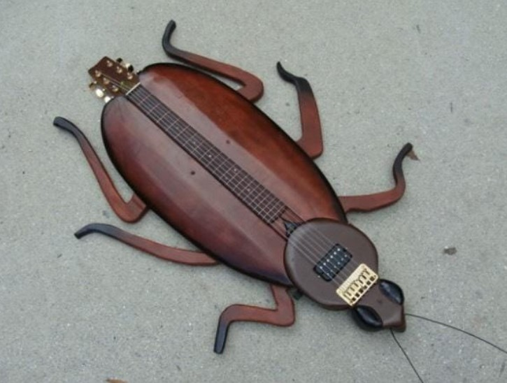

<html lang="en">
<head>
    <meta charset="UTF-8">
    <meta name="viewport" content="width=device-width, initial-scale=1.0"> <title>Top 5 guitarras</title>
    
    <link href="broma.py">
    <!--Primer proyecto personal mio, deseadme suerte-->
</head>
<body>
    

        <header>
            <h1>Hoy presentamos: Top 5 guitarras</h1>
        </header>
        

        <nav>
            <ul>
                <li><a href="https://www.google.com/url?sa=t&rct=j&q=&esrc=s&source=web&cd=&cad=rja&uact=8&ved=2ahUKEwj9uZOm0JOJAxVjSDABHa8mJ9YQtwJ6BAgREAI&url=https%3A%2F%2Fm.youtube.com%2Fwatch%3Fv%3DYGVQ-eg2FWo&usg=AOvVaw2UwbIQ7pe_epgFxmZA76Du&opi=89978449">Fuente 1</a></li>
                <li><a href="https://youtu.be/dQw4w9WgXcQ?si=wxstFcTZFNEBtayq">Press it</a></li>
                <li><a href="https://www.google.com/url?sa=t&rct=j&q=&esrc=s&source=web&cd=&cad=rja&uact=8&ved=2ahUKEwj9uZOm0JOJAxVjSDABHa8mJ9YQtwJ6BAgREAI&url=https%3A%2F%2Fm.youtube.com%2Fwatch%3Fv%3DYGVQ-eg2FWo&usg=AOvVaw2UwbIQ7pe_epgFxmZA76Du&opi=89978449">Fuente 3</a></li>
                <li><a href="https://www.google.com/url?sa=t&rct=j&q=&esrc=s&source=web&cd=&cad=rja&uact=8&ved=2ahUKEwj9uZOm0JOJAxVjSDABHa8mJ9YQtwJ6BAgREAI&url=https%3A%2F%2Fm.youtube.com%2Fwatch%3Fv%3DYGVQ-eg2FWo&usg=AOvVaw2UwbIQ7pe_epgFxmZA76Du&opi=89978449">Fuente 4</a></li>
                <li><a href="https://youtu.be/RIsjU6jHO5Y?si=2zk3I2IraYR72rxw">Fuente: miami me lo confirmo</a></li>
            </ul>
        </nav>
        

            

            <section id = "content">
                <article class = 'article'>
                    <h2>NUMERO UNO: guitarra cucaracha</h2>
                    
<i>En esta ocasión podemos apreciar una guitarra avistada en una calle con una forma peculiar, la forma de un 
                        insecto que todos amamos. Adjuntamos prueba...
                    </i>

                    

                        <button id="meinbutton">
                        cucatarra
                    </button>

                </article>
                <article class = 'article'>
                    <h2>NUMERO DOOS: guitarra QUEESOOO</h2>
                    
<i>presentamos la guitarra queso, con amor</i>

                    

                        <button>More cheez</button>
                    

                </article>
                <article class="article">
                    <h2>NUMERO TREES: Guitarra pistola</h2>
                    
Por si las moscas dicen

                    <button id="popup3">
                        PUM
                    </button>
                </article>
                <article class="article">
                    <h2>NUMERO CUATROO: Guitagui</h2>
                    
<i>En esta ocasión podeos apreciar una peculiar guitarra la cual empieza como una 'gui', continua 'ta' pero culmina de nuevo con 'GUI'</i>

                    <button id="popup4">
                        Watafac
                    </button>
                </article>
                <article>
                    <h2>QUINTA Y ULTIMAAAAA LA PODEROSISIMA DEFECASTER</h2>
                    
Hecha por Lucho, un saludo y sin mas comentarios

                    <button id = "joder">
                        Uyuyuy que desgracia
                    </button>
                </article>
                <article class="article">
                    <h1>Las guitarras:</h1>
                    
Dejamos las imágenes de estas y más guitarras en una linda galería, sin más que añadir, adiós.

                </article>
            </section>
        

        <aside>
            <h1><i>Deje sus comentarios</i></h1>
            <form>
                <label>Deje su nombre</label>
                <input type="text"> 
                <label>Deje su Email</label>
                <input type="url">  
                <label>Ahora si, deje sus comentarios al respecto</label> 
                <input type="text">
                <button id="fickdich">
                    Enviar comentarios  
                </button>
                JDSFJKDSAJK DE VERDAD CREIA QUE YO IBA A LEER SUS COMENTARIOS
            </form>
        </aside>
         <section id="shet">
            
            
            
            
            
            
            
            
            
            
            
            
            
            
            
            
         </section>
        <footer>
            <b>Esta estupidez de página fue creada por: J. Duarte</b>
        </footer>
    

    
</body>
</html>
